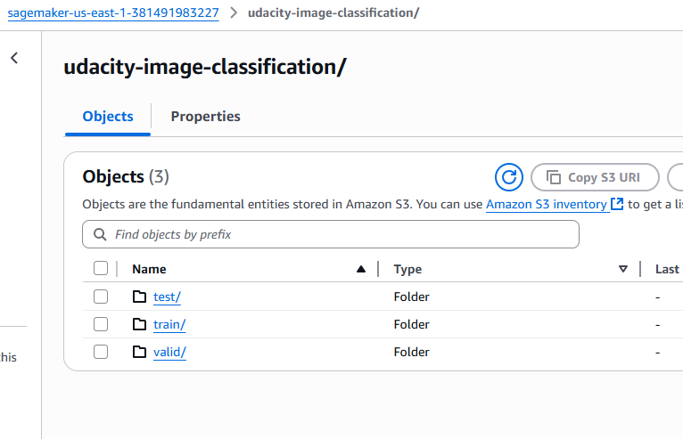
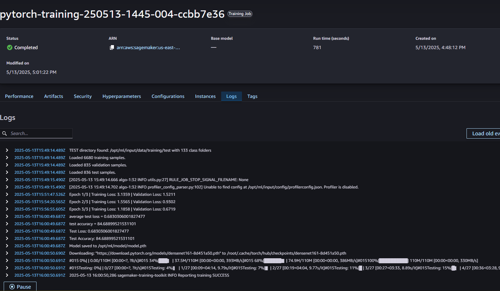

# Image Classification using AWS SageMaker

In this project, we use AWS SageMaker to train a pretrained model that can perform image classification by using the SageMaker profiling, debugger, hyperparameter tuning, and other good ML engineering practices.

**Note**: This project is part of the AWS Machine Learning Engineer Nanodegree by Udacity.

---

## Dataset

We used the **Dog Breed Classification** dataset which includes images from 133 dog breeds split into training, validation, and test directories. The dataset is available [here](https://s3-us-west-1.amazonaws.com/udacity-aind/dog-project/dogImages.zip).

> **Note**: The structure used is standard `ImageFolder` format:

```
data_dir/
    train/
        class1/
        class2/
    valid/
        class1/
        class2/
    test/
        class1/
        class2/
```

---

## Project Set Up and Installation

1. Open SageMaker Studio.
2. Clone the starter [repo](https://github.com/udacity/CD0387-deep-learning-topics-within-computer-vision-nlp-project-starter).
3. Download the dataset and unzip it if needed.
4. Upload the data to an S3 bucket for SageMaker access.
5. Use the provided scripts:

   * [`hpo.py`](./hpo.py) for hyperparameter tuning
   * [`train_model.py`](./train_model.py) for model training and debugging

---

## Hyperparameter Tuning

We chose **DenseNet-161** for its strong image classification performance. The `hpo.py` script defines the tuning job using `HyperparameterTuner`.

### Hyperparameters

* `learning_rate`: ContinuousParameter(0.001, 0.1)
* `batch_size`: CategoricalParameter(\[32, 64, 128])
* `epochs`: IntegerParameter(5, 20)

Best hyperparameters found:

Training job logs:



---

## Debugging and Profiling

We added debugging and profiling tools directly in the `train_model.py` script:

```python
rules = [
    Rule.sagemaker(rule_configs.vanishing_gradient()),
    Rule.sagemaker(rule_configs.overfit()),
    Rule.sagemaker(rule_configs.overtraining()),
    Rule.sagemaker(rule_configs.poor_weight_initialization()),
    ProfilerRule.sagemaker(rule_configs.ProfilerReport()),
]

profiler_config = ProfilerConfig(
    system_monitor_interval_millis=500, framework_profile_params=FrameworkProfile(num_steps=10)
)

debugger_hook_config = DebuggerHookConfig(
    hook_parameters={"train.save_interval": "100", "eval.save_interval": "10"}
)
```

These are passed to the estimator during training:

### Results

* The training job showed **I/O bottlenecks** as seen in GPU utilization plots.
* Top 3 operations: `copy_`, `contiguous`, `to` (high memory overhead)
* Rule triggers: `LowGPUUtilization`, `BatchSize` due to smaller batch size (e.g. 32)

#### Profiler output:


---

## Model Deployment

The deployment is implemented with a standalone `inference.py` script. We define only the `model_fn`:

```python
def model_fn(model_dir):
    model = models.densenet161(pretrained=False)
    num_features = model.classifier.in_features
    model.classifier = nn.Sequential(
        nn.Linear(num_features, 512),
        nn.ReLU(),
        nn.Dropout(0.3),
        nn.Linear(512, 133)
    )
    model.load_state_dict(torch.load(os.path.join(model_dir, "model.pth")))
    model.eval()
    return model
```

### Query Example

```python
image_path = "./dogImages/test/009.American_water_spaniel/American_water_spaniel_00655.jpg"
image = Image.open(image_path)
transform = transforms.Compose([
    transforms.Resize(224),
    transforms.ToTensor(),
])
preprocessed_image = transform(image).unsqueeze(0)
preprocessed_image = preprocessed_image.to("cpu")

response = predictor.predict(preprocessed_image)

pred = np.argmax(response, 1) + 1
actual = int(image_path.split('.')[1].split('/')[-1])
print(f"Actual: {actual}, Prediction: {pred[0]}")
```

This code loads a test image, applies the transformation used in training, sends it to the deployed endpoint, and prints the actual vs predicted class index.

Example result:


---

## Standout Suggestions

* Added dropout and ReLU in custom classifier
* Used `smdebug` and rules in estimator config
* Batch size tuning and profiler analysis to reduce bottlenecks

---

## Submission Checklist

* [x] Dataset uploaded and accessible via S3
* [x] `train_model.py` implements training and profiling
* [x] `hpo.py` implements tuning with multiple parameters
* [x] Training logs captured with screenshots
* [x] Profiler report screenshot added
* [x] Endpoint deployed and tested
* [x] Inference results captured with screenshots

